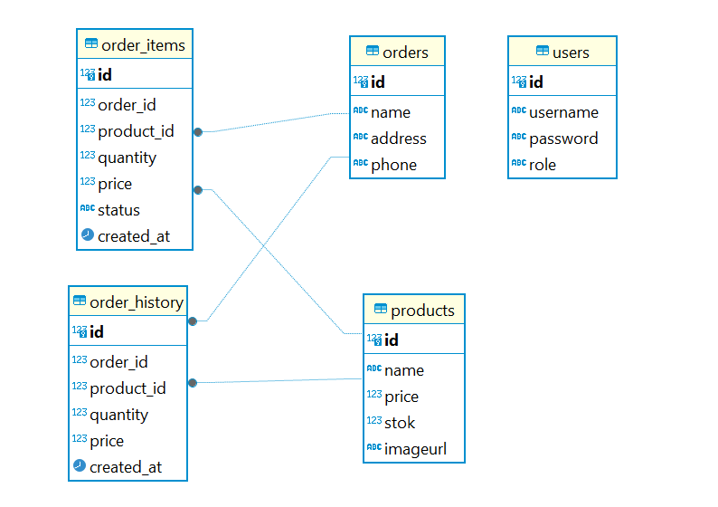

#SiAci Yummy

SiAci Yummy adalah merek terkemuka dalam industri restoran
yang mengusung konsep olahan aci (tepung kanji) dengan cita
rasa yang sangat lezat dan memuaskan. Nama "SiAci Yummy"
merupakan gabungan dari dua kata yang memiliki makna mendalam:
"SiAci" yang berasal dari kata "aci," merujuk pada bahan dasar
utama kami yang berbasis tepung kanji, dan "Yummy" yang
berarti enak atau lezat. Kombinasi ini mencerminkan komitmen
kami untuk menghadirkan makanan aci yang tidak hanya enak
tetapi juga menggugah selera.

##Fitur
- Login dan Registrasi
- LogOut
- Home
- User
    - Product       
    - Order
    - Cart
        - Delete Cart
    - About
- Admin
    - List Product
        - Create
        - Read
        - Update
        - Delete
    - Order
        - Accepted Order
        - delete
    - History Order
        - Print
- Search
- Sort 
    - ascending
    - Descending

# Diagram ERD

# Tech Stack

- Frontend: react.js, tailwind CSS
- Backend: Node.js, Express
- DB: postgresSql
- Devops: -
